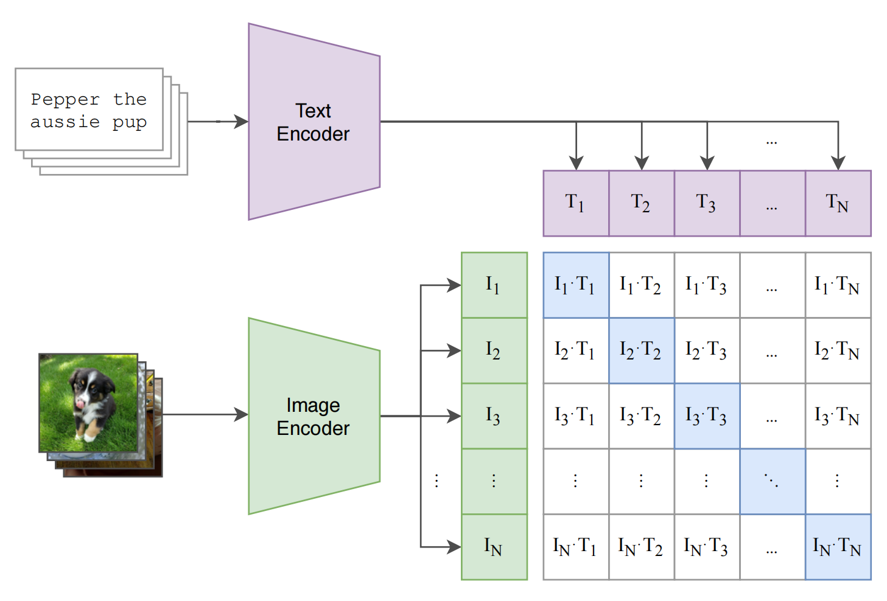
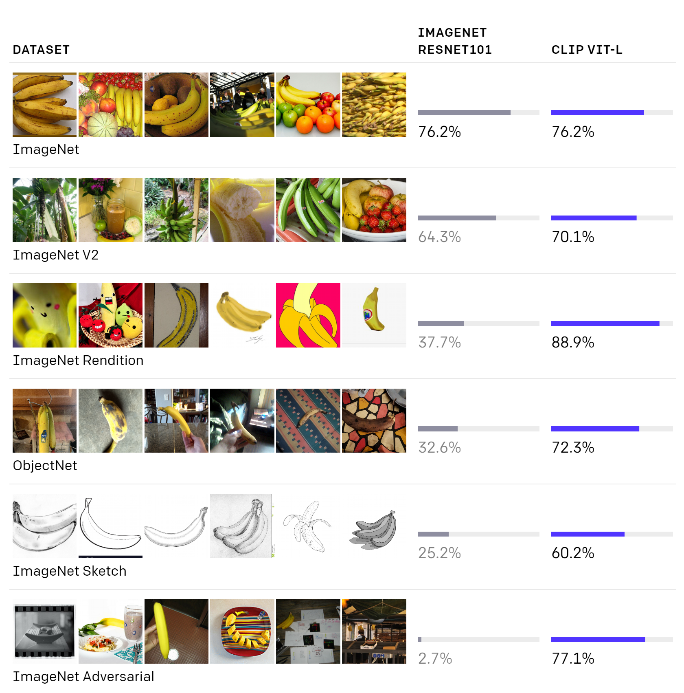

---
In the past decade, Neural Networks show powerful ability in such CV and NLP fields. However, in reality, text data and image data often interact. That is, combining the image and text information is a way of thinking closely to humans. Moreover, using the linear layer, most present classification models are trained to predict a fixed set of predetermined objects. This restriction limits their generality. OpenAI Proposes CLIP, a multimodal model trained using image-text pairs to break these deficiencies.

## Learning Transferable Visual Models From Natural Language Supervision

Keywords: *Multimodal*, *Zero-shot*, *CLIP*

## 1. Introduce

Recently, more and more task-agnostic architectures have been applied in NLP, demonstrating that pre-training approaches using web-scale collections surpass that of high-quality crowd-labeled NLP datasets. At the same time, CV researchers also develop the model to learn directly from web text. However, due to the weak performance or generality, there is still no unified paradigm for using natural language supervision for image representation learning. Current models, for example, can only predict a fixed set of objects without finetuning, extremely restricting the zero-shot capability. Furthermore, the scale of the dataset is also a crucial factor for learning directly in natural language.

To overcome the limitations mentioned above, authors first create a larger dataset of 400 million image-text pairs from the Internet and then implement contrastive learning to train the CLIP. Extensive experiments show that CLIP performs effectively in many tasks, including classification, OCR, and so on. The results of zero-shot transfer are particularly impressive, as they are both robust and competitive with prior task-specific supervised learnings.

## 2. Approach

### 2.1 Dataset

The presented datasets are not suitable for CLIP training. MS-COCO and Visual Genome are both high-quality crowed-labeled but small by modern standards. In YFCC100M, the metadata for each image is sparse and of varying quality. To satisfy the huge demand for data, the authors constructed a new dataset of 400 million image-text pairs named WIT.

### 2.2 Overall Architecture

  
CLIP consists of an image encoder(such as ResNet, or ViT) and a Text encoder(Transformer-based) without the pre-trained parameters. Considering the large amount of 400 million pairs, the authors train the CLIP to predict only which text should be paired with which image. By applying this contrastive learning paradigm, the training complexity and the resource consumption are significantly reduced. As shown in the figure, the elements on the diagonal of the matrix are positive samples, and the others are negative samples. The image Encoder and the Text Encoder will output the embedding vectors of images and text respectively. These two vectors will pass through a linear projection to map from each encoder's representation to the multi-modal embedding space. As to the target function, CLIP aims to minimize the Cosine Similarity between the two embeddings. It is worth noting that CLIP only applies random square crops to augment the data.

When testing, the words of the objective set will send into a prompt, such as 'A photo of a {object}'. Then, the embeddings will be obtained by the image encoder and the text encoder. CLIP will map the image to the text with the highest embedding similarity. 

## 3. Experiments

  
The authors carried out numerous task-related experiments and ambulation studies. Here present the most amazing one. CLIP(which uses ViT-L as the image encoder) achieves the same performance on ImageNet as ResNet101. However, when transferring to other datasets, such as ObjectNet and ImageNet Adversarial, the effect of CLIP is significantly greater than ResNet101. To summarize, CLIP gained strong semantic information by combining text information, which greatly improved its Zero-shot transfer ability.

